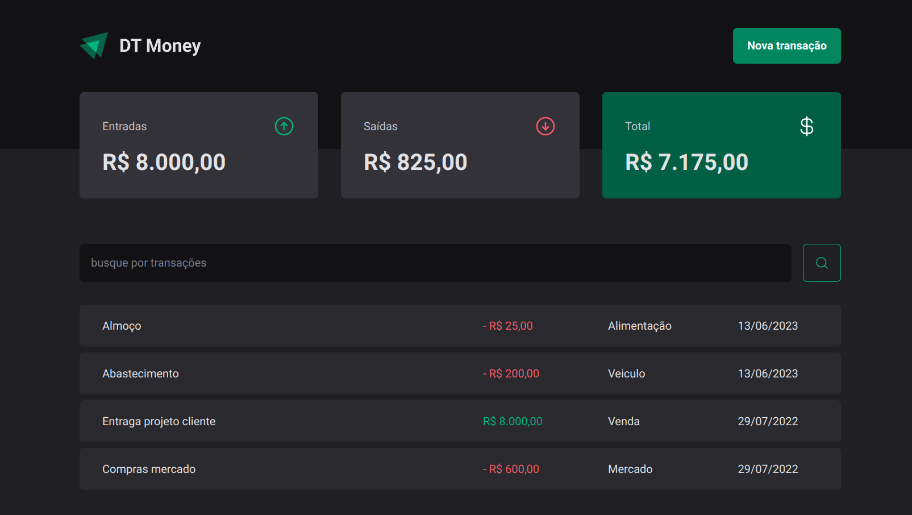
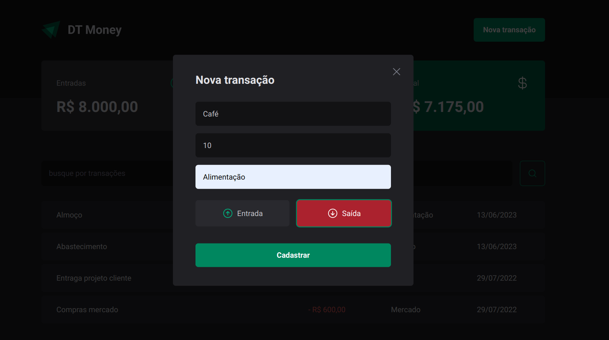

<h1 align="center">dtMoney</h1>

## Introdução

O dtMoney é uma aplicação WEB desenvolvida com Reactjs para controle financeiro. No dtMoney o usuário cadastra suas transações financeiras, recebimentos e gastos, para obter um melhor controle de suas transações financeira. 

É um projeto desenvolvido durante o módulo 3 do curso de Reactjs ignite 2022 ministrado pela Rocketseat, com o intuíto de aplicar os conceitos de contextos, apis, formulários controlados, e performance.

<div align="center" >
  
  
</div>

## Requisitos

- Nodejs 16.20
- npm 8.19

## Tecnologias

- ReactJS
- Vite
- Typescript
- Style Components
- Radix UI
- Context
- Axios
- React Hook Forms
- Validação com ZOD
- Json Server
- Phosphor React Icons

## Instalação

```sh
# Fazer o clone do projeto em uma máquina local
git clone https://github.com/marciovz/dtmoney-reactjs-ignite2022.git
```

```sh
# Acessa a pasta do projeto
cd dtmoney-reactjs-ignite2022
```

```sh
# Rodar a instalação das dependências do projeto
npm install
```

## Rodando a aplicação

```sh
# Rodar o servidor json-server
npm run dev:server

# Rodar a aplicação localmente
npm run dev
```

Abrir a aplicação no navegador no endereço http://localhost:3000


## Melhorias

- Aplicar testes
- Fazer o layout Responsivo


